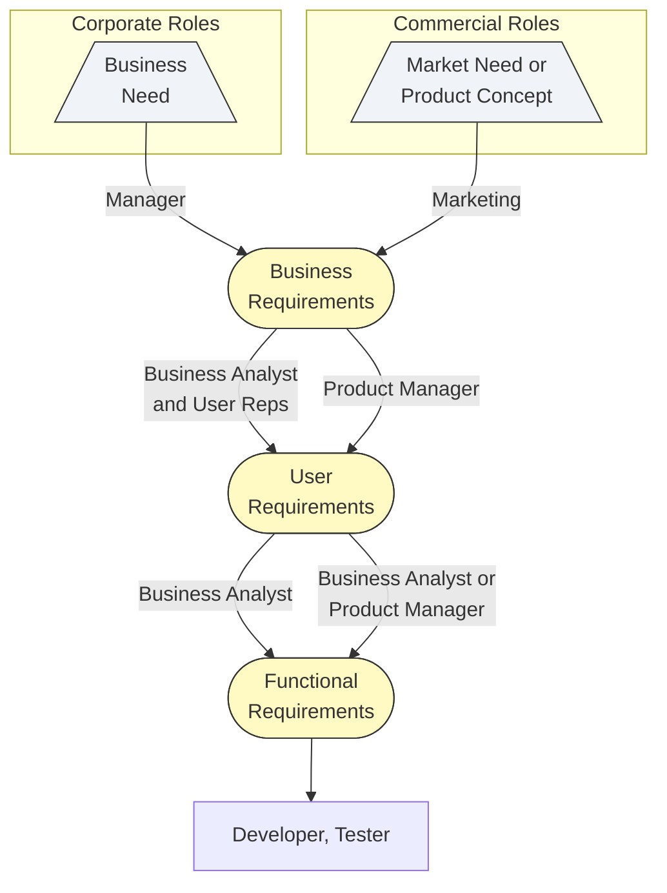

# An example of how different stakeholders participate in requirements development

## This diagram is specifically important for a Test Analyst:

* **Defining the Test Basis:** This flow clearly identifies the documents that serve as the "Test Basis" (the source of truth for testing):
   * UAT (User Acceptance Testing): Is based on the User Requirements node.
   * System Testing: Is primarily based on the Functional Requirements node.

* **Traceability:** This hierarchy demonstrates the "Golden Thread" of traceability. A Test Analyst must ensure every test case written (at the bottom level) can be traced back up to a specific User Requirement and, ultimately, a Business Need. If a test fails, you use this flow to determine if the software is broken or if the requirement was misunderstood upstream.

* **The "Waterfall" Risk:** The diagram shows the Tester appearing only at the very end (the bottom arrow). Fora modern Test Analyst, this highlights a risk area. You should advocate to be involved earlier - ideally during the review of "User Requirements" - to prevent defects before they reach the "Functional Requirements" stage (the concept of "Shift Left").
