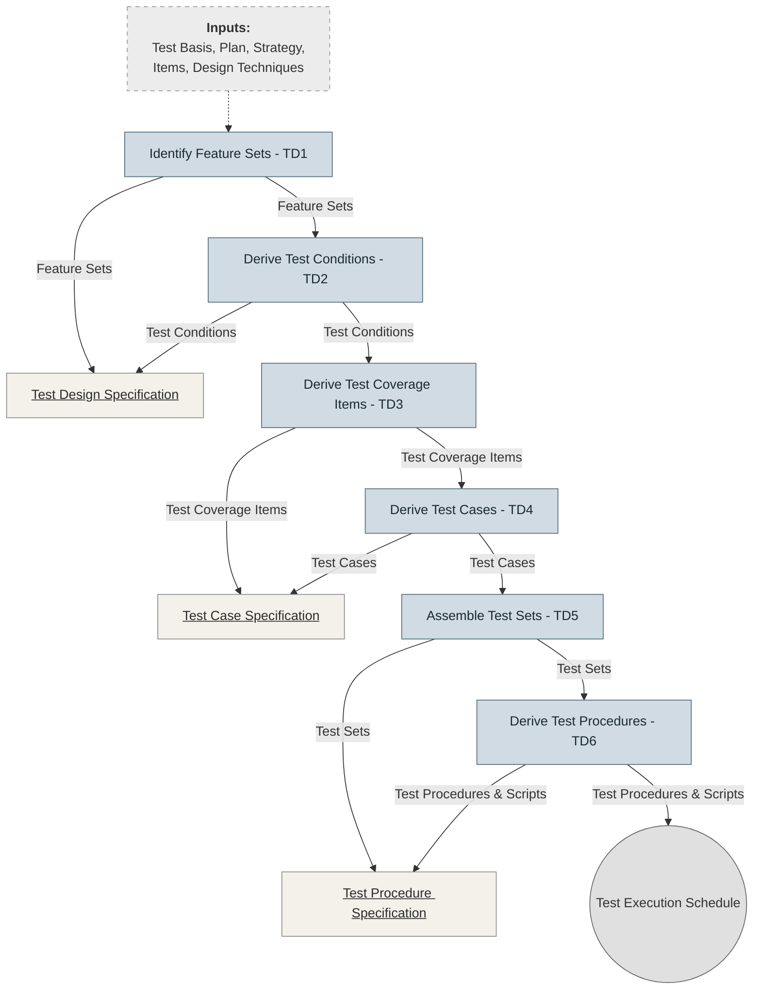

# Test Design & Implementation Process

## Overview
This process describes the systematic transformation of the test basis into test cases and test procedures. While shown as sequential, it is often performed iteratively.

## Inputs to the Process
- **Test basis:** (Requirements, architecture, etc.)
- **Test plan:** (Scope and schedule)
- **Test strategy:** (Approach and tools)
- **Test items:** (The software/system under test)
- **Test design techniques:** (Black-box, white-box, etc.)

##  Diagram Test Design & Implementation Process

---

## Step-by-Step Test Design & Implementation Process

Based on the ISTQB Syllabus 4.0 (Section 1.4.1), the process follows these six logical stages:

## TD1: Identify Feature Sets
* **Description:** The process begins by analyzing the Test Basis (requirements, user stories, design specs) to identify distinct "Feature Sets."
* **Analyst Focus:** Grouping related functionalities into logical sets to define the scope of what needs to be tested.
* **Output:** Initial identification of feature boundaries.

## TD2: Derive Test Conditions
* **Description:** For each feature set, you determine Test Conditions - the "what to test" (e.g., specific business rules, functions, or quality attributes).
* **Analyst Focus:** Turning high-level requirements into testable statements. This is the foundation of the Test Design Specification.

## TD3: Derive Test Coverage Items
* **Description:** You identify specific Test Coverage Items that will serve as the measurable units of testing (e.g., individual lines of code, specific requirement IDs, or state transitions).
* **Analyst Focus:** Ensuring that the test design has objective criteria for "completeness" so you can report exactly how much of the requirement is covered.

## TD4: Derive Test Cases
* **Description:** Detailed Test Cases are developed, including preconditions, inputs, and expected results. These are documented in the Test Case Specification.
* **Analyst Focus:** Translating abstract conditions into concrete scenarios with specific data to verify that the system behaves as expected.

## TD5: Assemble Test Sets
* **Description:** Test cases are organized and grouped into Test Sets (also known as Test Suites).
* **Analyst Focus:** Organizing tests by theme (e.g., Smoke, Regression, Sanity) or by functional area to streamline the execution process.

## TD6: Derive Test Procedures
* ***Description:** Final Test Procedures and Manual/Automated Test Scripts are created. These describe the sequence of actions to run the tests.
* **Analyst Focus:** Prioritizing and arranging these procedures within a Test Execution Schedule. This ensures that the most critical or high-risk tests are executed first for maximum efficiency.
---

## Importance for a Test Analyst

* **Risk Mitigation:** By moving systematically from TD1 to TD3, you ensure that no requirement is overlooked, reducing the risk of missing critical bugs.
* **Structural Efficiency:** You learn that writing a test case (TD4) is not the first step. Proper analysis (TD1-TD3) ensures your test cases are high-quality and relevant.
* **Measurable Progress:** By deriving Coverage Items (TD3), you provide the data needed to answer the most common stakeholder question: "How much of the system have we actually tested?"
* **Operational Excellence:** Moving into Test Implementation (TD5-TD6) allows you to build a repeatable and optimized execution schedule, which is essential for meeting deadlines in fast-paced Agile or DevOps environments.
